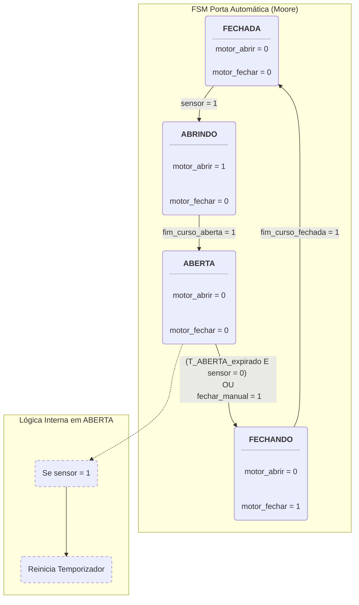

```mermaid

%% =================================================================================
%% Diagrama da Máquina de Estados Finitos (FSM) para o Controle de Porta Automática
%% Estilo de Implementação: Moore
%% =================================================================================

%% Declara o tipo de diagrama como um gráfico ('graph') e a orientação padrão como Top-Down ('TD').
graph TD
    %% Agrupa todos os elementos principais da FSM sob um título comum para organização.
    subgraph "FSM Porta Automática (Moore)"
        %% Altera a direção do layout para Left-to-Right ('LR'), que é mais comum para FSMs.
        direction LR
        
        %% ----------------------------------------------------------------
        %% SEÇÃO 1: Definição dos Estados da FSM
        %% Cada estado é um nó no diagrama e define as saídas (motores) que estarão ativas.
        %% ----------------------------------------------------------------

        %% ESTADO 1 (INICIAL): A porta está parada e totalmente fechada. Ambos os motores estão desligados.
        S_FECHADA("
            <b>FECHADA</b>
            <hr> motor_abrir = 0
            <br> motor_fechar = 0
        ")

        %% ESTADO 2: O ciclo de abertura foi iniciado. O motor de abrir está ligado.
        S_ABRINDO("
            <b>ABRINDO</b>
            <hr>
            motor_abrir = 1
            <br>
            motor_fechar = 0
        ")

        %% ESTADO 3: A porta está parada e totalmente aberta. Os motores estão desligados e o temporizador T_ABERTA é ativado.
        S_ABERTA("
            <b>ABERTA</b>
            <hr>
            motor_abrir = 0
            <br>
            motor_fechar = 0
        ")

        %% ESTADO 4: O ciclo de fechamento foi iniciado. O motor de fechar está ligado.
        S_FECHANDO("
            <b>FECHANDO</b>
            <hr>
            motor_abrir = 0
            <br>
            motor_fechar = 1
        ")

        %% ----------------------------------------------------------------
        %% SEÇÃO 2: Definição das Transições entre Estados
        %% As setas representam as condições que fazem a FSM mudar de um estado para outro.
        %% ----------------------------------------------------------------

        %% TRANSIÇÃO (REGRA 3.1): Se a porta está FECHADA e o sensor detecta uma pessoa, inicia-se o ciclo de abertura.
        S_FECHADA -- "sensor = 1" --> S_ABRINDO

        %% TRANSIÇÃO (REGRA 3.2): Durante a abertura, ao atingir o fim de curso, o motor para e a porta é considerada ABERTA.
        S_ABRINDO -- "fim_curso_aberta = 1" --> S_ABERTA
        
        %% TRANSIÇÃO (REGRA 3.3): Quando ABERTA, a porta começa a fechar se o tempo expirar (sem ninguém no sensor) OU se o fechamento manual for acionado.
        S_ABERTA -- "(T_ABERTA_expirado E sensor = 0) <br> OU <br> fechar_manual = 1" --> S_FECHANDO
        
        %% TRANSIÇÃO (REGRA 3.4): Durante o fechamento, ao atingir o fim de curso, o motor para e a porta volta ao estado FECHADA.
        S_FECHANDO -- "fim_curso_fechada = 1" --> S_FECHADA

    end

    %% ----------------------------------------------------------------
    %% SEÇÃO 3: Representação de Ações Internas (Não são Estados)
    %% ----------------------------------------------------------------

    %% BLOCO VISUAL (REGRA 3.5): Este bloco não é um estado da FSM. Ele representa uma AÇÃO que ocorre DENTRO do estado ABERTA.
    subgraph "Lógica Interna em ABERTA"
        direction LR
        A_LOGIC("Se sensor = 1")
        A_ACTION("Reinicia Temporizador")
        A_LOGIC --> A_ACTION
    end

    %% LIGAÇÃO VISUAL (REGRA 3.5): A linha pontilhada (-.->) mostra que a detecção de uma pessoa no estado ABERTA dispara a lógica de reiniciar o timer, SEM mudar de estado.
    S_ABERTA -.-> A_LOGIC

    %% ----------------------------------------------------------------
    %% SEÇÃO 4: Estilização Visual do Diagrama
    %% ----------------------------------------------------------------

    %% Aplica um estilo de borda tracejada aos nós da "Lógica Interna" para diferenciá-los visualmente dos estados reais da FSM.
    style A_LOGIC stroke-dasharray: 5 5
    style A_ACTION stroke-dasharray: 5 5

```