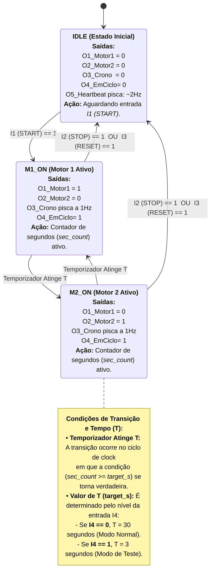

```mermaid

stateDiagram-v2
    %% =======================================================================
    %% Diagrama de Estados Detalhado: Motores Alternados
    %% Projeto:      Motores Alternados
    %% Arquivo:      stateDiagram.md
    %% Versão:       1.1 (Comentários e descrições revisadas)
    %%
    %% DESCRIÇÃO:
    %% Este diagrama representa a Máquina de Estados Finitos (FSM) implementada
    %% no arquivo 'motores_alternados.sv'. Ele detalha os estados, as saídas
    %% em cada estado e as condições exatas para as transições.
    %% =======================================================================

    [*] --> IDLE

    state "<b>IDLE (Estado Inicial)</b>
            <b>Saídas:</b>
            O1_Motor1 = 0
            O2_Motor2 = 0
            O3_Crono  = 0
            O4_EmCiclo= 0
            O5_Heartbeat pisca: ~2Hz
            <b>Ação:</b> Aguardando entrada <i>I1 (START)</i>." as IDLE

    state "<b>M1_ON (Motor 1 Ativo)</b>
            <b>Saídas:</b>
            O1_Motor1 = 1
            O2_Motor2 = 0
            O3_Crono pisca a 1Hz
            O4_EmCiclo= 1
            <b>Ação:</b> Contador de segundos (<i>sec_count</i>) ativo." as M1_ON

    state "<b>M2_ON (Motor 2 Ativo)</b>
            <b>Saídas:</b>
            O1_Motor1 = 0
            O2_Motor2 = 1
            O3_Crono pisca a 1Hz
            O4_EmCiclo= 1
            <b>Ação:</b> Contador de segundos (<i>sec_count</i>) ativo." as M2_ON

    %% Definição das Transições da FSM
    IDLE --> M1_ON : I1 (START) == 1

    M1_ON --> M2_ON : Temporizador Atinge T
    M2_ON --> M1_ON : Temporizador Atinge T

    M1_ON --> IDLE : I2 (STOP) == 1  OU  I3 (RESET) == 1
    M2_ON --> IDLE : I2 (STOP) == 1  OU  I3 (RESET) == 1

    note right of M2_ON
      <b>Condições de Transição e Tempo (T):</b>
      • <b>Temporizador Atinge T:</b> A transição ocorre no ciclo de clock
        em que a condição (<i>sec_count >= target_s</i>) se torna verdadeira.
      • <b>Valor de T (target_s):</b> É determinado pelo nível da entrada I4:
        - Se <b>I4 == 0</b>, T = 30 segundos (Modo Normal).
        - Se <b>I4 == 1</b>, T = 3 segundos (Modo de Teste).
    end note
```