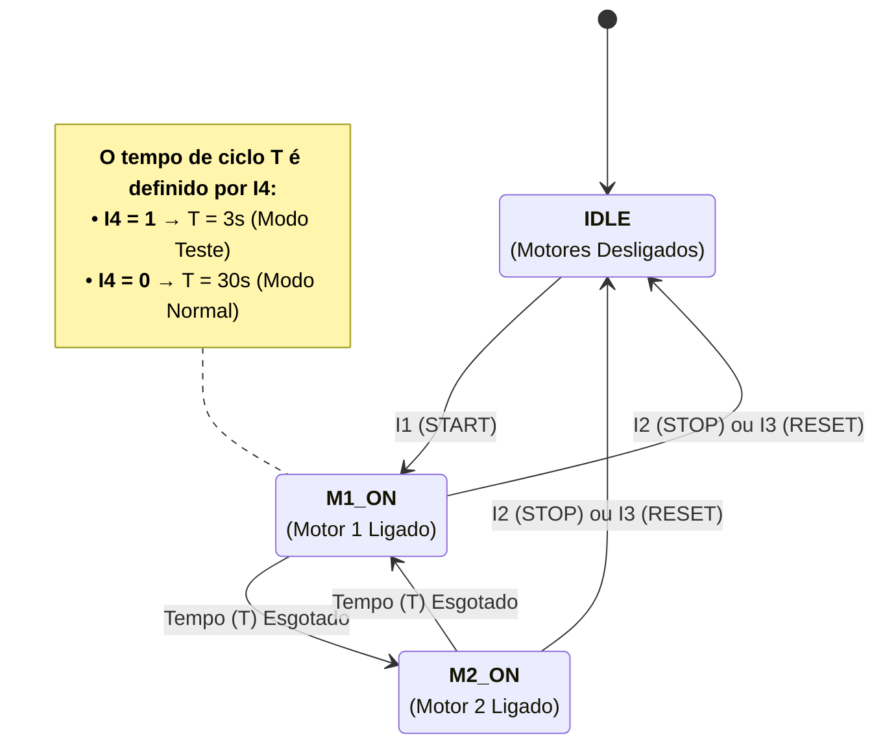

```mermaid

stateDiagram-v2
    %% =======================================================================
    %% Diagrama de Estados Simplificado
    %% Projeto:      Motores Alternados
    %% Arquivo:      stateDiagram_basico.md
    %% Versão:       1.1 (Comentários e descrições revisadas)
    %%
    %% DESCRIÇÃO:
    %% Uma visão de alto nível da FSM, mostrando apenas os estados
    %% principais e os eventos que causam as transições.
    %% =======================================================================

    [*] --> IDLE

    state "<b>IDLE</b><br/>(Motores Desligados)" as IDLE
    state "<b>M1_ON</b><br/>(Motor 1 Ligado)" as M1_ON
    state "<b>M2_ON</b><br/>(Motor 2 Ligado)" as M2_ON

    IDLE  --> M1_ON : I1 (START)
    
    M1_ON --> M2_ON : Tempo (T) Esgotado
    M2_ON --> M1_ON : Tempo (T) Esgotado

    M1_ON --> IDLE  : I2 (STOP) ou I3 (RESET)
    M2_ON --> IDLE  : I2 (STOP) ou I3 (RESET)

    note left of M1_ON
        <b>O tempo de ciclo T é definido por I4:</b>
        • <b>I4 = 1</b> → T = 3s (Modo Teste)
        • <b>I4 = 0</b> → T = 30s (Modo Normal)
    end note
```